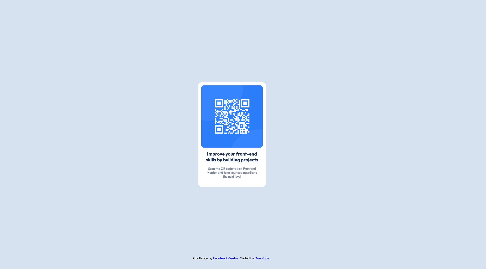

# Frontend Mentor - QR code component solution

This is a solution to the [QR code component challenge on Frontend Mentor](https://www.frontendmentor.io/challenges/qr-code-component-iux_sIO_H). Frontend Mentor challenges help you improve your coding skills by building realistic projects. 

## Table of contents

- [Overview](#overview)
  - [Screenshot](#screenshot)
  - [Links](#links)
- [My process](#my-process)
  - [What I learned](#what-i-learned)
  - [Useful resources](#useful-resources)
- [Author](#author)

## Overview

### Screenshot

### Links

- Solution URL: [Add solution URL here](https://your-solution-url.com)
- Live Site URL: [Add live site URL here](https://your-live-site-url.com)

## My process

### What I learned

I learned to utilize the normal flow of the page while adding in flexbox when necessary. This ensured that the img and text areas were aligning properly with the parent box, the entire QR code section.

### Useful resources

- [MDN Web Docs](https://developer.mozilla.org/en-US/docs/Learn) - These are a great resource that helped me with most of my issues around forgetting the specific property names.

## Author

- GitHub - [dtp27](https://github.com/dtp27)
- Frontend Mentor - [@dtp27](https://www.frontendmentor.io/profile/dtp27)
